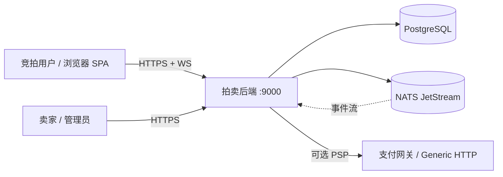

# go-online-auction 系统设计文档与提升判断

> 本文档基于对仓库实际代码的核查（非仅 README）整理，所有关键结论均标注了对应的代码位置。
> 核查时间：2026-07-20。代码事实优先级高于 README（README 存在多处陈旧描述，见 §8）。

---

## 目录

- [第一部分：详细设计文档](#第一部分详细设计文档)
  - [1. 系统概述与目标](#1-系统概述与目标)
  - [2. 系统上下文（C4 L1）](#2-系统上下文c4-l1)
  - [3. 业务领域模型](#3-业务领域模型)
  - [4. 架构原则](#4-架构原则)
  - [5. 模块划分与标准分层](#5-模块划分与标准分层)
  - [6. 进程 / 部署拓扑与依赖注入](#6-进程--部署拓扑与依赖注入)
  - [7. 关键架构机制](#7-关键架构机制)
  - [8. 数据模型概览](#8-数据模型概览)
  - [9. 配置、运维与质量门禁](#9-配置运维与质量门禁)
  - [10. 测试现状](#10-测试现状)
- [第二部分：提升点判断](#第二部分提升点判断)
  - [P0 — 功能 / 部署正确性](#p0--功能--部署正确性)
  - [P1 — 架构一致性 / 技术债](#p1--架构一致性--技术债)
  - [P2 — 工程化 / 可观测性 / 生产就绪](#p2--工程化--可观测性--生产就绪)
  - [演进路线图建议](#演进路线图建议)

---

# 第一部分：详细设计文档

## 1. 系统概述与目标

`go-online-auction` 是一个面向高并发的实时在线拍卖系统，后端 Go、前端 React（演示用 SPA）。核心工程目标是**在高吞吐出价场景下保证一致性**，并具备横向扩展能力。

系统采用 **六边形架构 + CQRS + 领域驱动设计（DDD）+ 事件驱动** 的组合，辅以 **Uber Fx 依赖注入** 与 **Cobra CLI**。消息中间件为 **NATS JetStream**（已移除早期 README 描述的 Redis），持久化为 **PostgreSQL + pgx**，SQL 经 **sqlc** 生成类型安全代码，迁移用 **goose** 管理。

> 实际 HTTP/WebSocket 端口为 **9000**（`.env` 与运行配置）；README 正文中多处写 8080 为笔误（见 §8.3）。

## 2. 系统上下文（C4 L1）



**参与者 / 外部系统**
- 竞拍用户：通过 REST 出价、订阅 `/ws/v1/auctions/:id` 接收实时事件。
- 卖家 / 管理员：创建拍卖、管理类目（SPU/SKU）、保证金管理。
- PostgreSQL：唯一持久化存储（含共享 `event_outbox` 表）。
- NATS JetStream：命令流（`auction.cmd.bid.*`，WorkQueue）+ 事件流（`*.evt.*`，Limits/可重放）+ DLQ。
- 支付网关（可选）：经 `PaymentPort` 抽象，默认 mock，`generic` 适配器走配置化 HTTP。

## 3. 业务领域模型

限界上下文（Bounded Context）划分为 4 个领域模块：

| 上下文 | 核心聚合 / 实体 | 关键值对象 / 枚举 |
|--------|----------------|-------------------|
| **auction** | `AuctionModel`（聚合根）、`BidModel` | `MoneyModel`、`AuctionStateEnum`（draft/active/closed/cancelled）、`TradingModeEnum`（english/dutch/sealed_bid/vickrey/fixed_price/ebay_proxy） |
| **deposit** | `DepositModel`（状态机） | `DepositStatusEnum`（pending→held→released\|applied\|forfeited） |
| **listing** | `CategoryModel`（物化路径树）、`SpuModel`、`SkuModel` | `MaxCategoryDepth = 6`（即 7 层） |
| **users** | `UserModel` | `RoleEnum`（admin/seller/bidder），JWT 令牌服务 |

**领域不变量（部分）**
- 新出价金额必须高于当前最高出价（领域层 `auction.PlaceBid` 校验）。
- 拍卖状态机：`draft → active → closed/cancelled`，非法转换报错。
- 保证金状态机：仅允许合法转换；非法转换返回 `ErrInvalidDepositTransition`（守卫在领域层）。
- 类目树最大深度受 `MaxCategoryDepth` 限制，超限返回 `ERR_CATEGORY_DEPTH_EXCEEDED`。

## 4. 架构原则

1. **六边形架构（端口与适配器）**：领域层（domain）零外部依赖；所有外部能力（DB、NATS、HTTP、支付）经 `ports` 接口反转，具体实现在 `infra`。
2. **CQRS**：命令（写）与查询（读）分离。命令加载聚合 → 领域方法 → 持久化 + 写 outbox → 提交后派发事件；查询直接走 sqlc 优化 SQL，返回 DTO，不实例化领域模型。
3. **事件驱动 + 事务性 Outbox**：状态变更与事件发布在**同一 DB 事务**内完成（at-least-once 保证），由独立 relay 轮询 outbox 表转发至 JetStream。
4. **DDD 富领域模型**：状态转换、业务规则封装在聚合内，命令处理器只做编排。
5. **依赖倒置 + 编译期图校验**：依赖关系全部经 `fx.Provide` + `fx.As(..., new(ports.X))` 声明，Fx 在启动期校验依赖图。

## 5. 模块划分与标准分层

4 个领域模块 + `internal/shared`（基础设施）+ `pkg`（公共 SDK）。标准分层（以 auction 为例）：

```
internal/modules/<module>/
├── domain/
│   ├── model/        # 聚合、实体、值对象
│   ├── enum/         # 枚举 + validate 映射
│   ├── errs/         # 领域错误
│   ├── event/        # 领域事件（auction 有，deposit/listing/users 无独立事件类型）
│   └── strategy/     # 交易模式策略（auction 特有）
├── application/
│   ├── command/      # 写用例（*Command.Execute）
│   ├── query/        # 读用例（*Query.Execute）
│   └── guard/        # deposit 特有（DepositGuard 实现）
├── ports/            # 六边形接口
└── infra/
    ├── repository/   # 仓储实现
    ├── mapper/       # 行 ↔ 领域映射
    ├── query/        # sqlc 输入 SQL
    ├── sqlcgen/      # sqlc 生成（不手写）
    ├── http/         # chi handler / router / dto / errs
    ├── uow/          # 工作单元（事务作用域）
    ├── outbox/       # outbox 仓储 + relay（auction 有 relay；deposit 仅有仓储）
    ├── messaging/    # NATS 发布/消费 + 出价处理器 + 结算消费者（auction/deposit）
    ├── payment/      # PaymentPort 实现（deposit）
    ├── websocket/    # hub + registry + client（auction/deposit）
    ├── scheduler/    # 拍卖定时启停（auction）
    └── gateway/      # 防腐层（listing 实现 auction 的 ListingValidator）
```

**偏差点**
- `users` 模块无 `domain/event`、无 outbox、无 websocket —— 它是纯 CRUD + 认证上下文，不接入事件总线。
- `deposit` 的 websocket 直接放在 `infra/websocket`（而非 `infra/http/chi`）。
- `listing` 多了 `infra/gateway/auction_listing_validator.go`，实现 auction 的 `ports.ListingValidator`，避免 auction 直接依赖 listing 内部模型（防腐层）。

## 6. 进程 / 部署拓扑与依赖注入

**没有单一全局组合根**——Fx 模块分散在 `cmd/` 各子命令中，`main.go` 仅做 `config.Init()` + `cmd.Execute()`（Cobra）。共 **10 个 `fx.Module`**（6 个 shared + 4 个领域模块），策略集合用 `fx.ResultTags("group:trading_strategy")` 聚合后由 `strategy.Resolver` 消费。

| 子命令 | 注册内容 | 说明 |
|--------|----------|------|
| `all` | 全部模块 + HTTP 路由 + WS + bid processor + **outbox relay** + scheduler + deposit hub/consumer + metrics | 一体化进程（`make run` 默认） |
| `auction` | auction 模块 + HTTP + **outbox relay** | 纯 HTTP + 事件转发 |
| `websocket` | auction 模块 + WS 路由 | 独立 WS 进程（**未注册 outbox relay**） |
| `bid_processor` | auction 模块 + bid processor | 独立出价处理器（**未注册 outbox relay**） |
| `db:migrate` / `create_admin` | 直接连库，不走 Fx | 运维命令 |

> WebSocket 与 HTTP **共用同一 `*httpserver.Server`（同端口 9000）**；`cmd/websocket.go` 是可选的独立 WS 进程入口，默认 `all` 模式已内含 WS。

## 7. 关键架构机制

### 7.1 命令 / 查询处理（无 Mediator）
无 CQRS 框架/中介者库。命令即结构体，暴露 `Execute(ctx, Input) (Output, error)`，由 Fx 构造后**直接注入** chi handler，handler 调用 `command.Execute(...)`。查询同理。这保持了极简与可测试性，但失去了统一横切（日志/追踪/鉴权）的中介层——目前横切靠 handler 层 + 中间件完成。

### 7.2 出价走命令流，其余命令直写
- **出价**是异步链路：`PlaceBidCommand` 不写库、不跑策略、不入 outbox，仅把 `ports.BidCommand` 发布到 NATS 命令流 `auction.cmd.bid.<id>`（WorkQueue，幂等键 = Nats-Msg-Id），立即返回 `202 Accepted`。
- 真正的出价处理在消费者端 `messaging.BidProcessor`：消费命令 → `depositGuard.EnsureEligible` → UoW → 取聚合 → `resolver.ForMode(mode)` 选策略 → `auction.PlaceBid` → 写库 + 写 outbox → 提交 → 反狙击延时 / 代理出价 / 必要时关闭。
- `Start`/`Close` 命令则直接走 UoW + outbox（由 HTTP 直接调用，不经命令流）。
- ⚠️ `CreateAuctionCommand` 直接 `auctionRepository.Create`，**不写 outbox、不发布 `auction_created` 事件**（见 P0-2）。

### 7.3 事务性 Outbox + Relay（at-least-once）
- 表 `event_outbox`（`migrations/000007`）：`event_id UNIQUE`、`subject`、`payload JSONB`、`published_at IS NULL` 表示待发；部分索引 `idx_event_outbox_unpublished`。
- 信封 `infra/event/envelope`：`Envelope{EventType, EventID, SchemaVersion, Timestamp, AuctionID, Data}`，`SchemaVersion = 1`，`Decode` 拒绝未知版本；`BuildSubject(auctionID) = "auction.evt.<id>"`。
- `Relay`（`auction/infra/outbox/relay.go`）：后台 ticker（默认 500ms / 批 200，来自 `OUTBOX_RELAY_INTERVAL`/`OUTBOX_RELAY_BATCH_SIZE`）轮询 `ListUnpublished` → `js.Publish(subject, payload, WithMsgID(eventID))` → `MarkPublished`。at-least-once + 流重复窗口去重；多实例安全（`MarkPublished` 受 `published_at IS NULL` 保护）。
- **关键事实**：auction 与 deposit 的 outbox 仓储**都写入同一张 `event_outbox` 表**（deposit 的 `outbox.sql` 也 `INSERT INTO event_outbox`）。因此 `all`/`auction` 模式下由 auction 的 relay 统一排空——deposit/listing 事件在默认部署下**确实会被发布**。但 relay 在 `cmd` 层是 auction 模块专属注册，存在架构耦合（见 P1-1）。

### 7.4 NATS 流拓扑
定义在 `internal/shared/modules/nats/streams.go`，`CreateOrUpdateStreams` 在 Fx `OnStart` 创建/更新：

| 流 | 主题 | 策略 | 用途 |
|----|------|------|------|
| `AUCTION_COMMANDS` | `auction.cmd.bid.*` | WorkQueue + File | 出价命令（处理即出队） |
| `AUCTION_EVENTS` | `auction.evt.*` | Limits（可重放）+ File + Duplicates | 拍卖领域事件 / 事件库 |
| `AUCTION_DLQ` | `auction.dlq.*` | Limits + File | 出价命令死信（MaxDeliver 5） |
| `LISTING_EVENTS` | `listing.evt.>` | Limits + File + Duplicates | 类目/SKU 事件 |
| `DEPOSIT_EVENTS` | `deposit.evt.*` | Limits + File + Duplicates | 保证金事件 |

命令流（竞争消费）与事件流（广播/持久/可重放）明确分流。

### 7.5 WebSocket 实时推送
- 组件：`websocket_hub.go`（`Hub` + `AuctionSubscriberRegistry` + `messaging.EventConsumer`）、`auction_subscriber_registry.go`（`map[uint64]map[*Client]struct{}`）、`websocket_client.go`（gorilla/websocket 读写泵）。
- 流：`EventConsumer` 以每节点 ephemeral consumer 消费 `auction.evt.*`（`DeliverNewPolicy`/`AckNone`）→ 按 subject 解析 auctionID → `Broadcast` 推送给该 auction 订阅者。
- Deposit 侧 `JetStreamDepositEventConsumer` 同理消费 `DEPOSIT_EVENTS` 驱动 `DepositHub`。

### 7.6 并发控制（多层级）
- 领域层：`if bid.Amount <= auction.HighestBidAmount { return ErrBidTooLow }`。
- 仓储层：`SELECT ... FOR UPDATE NOWAIT`（失败快速返回 `ErrConcurrencyConflict`）。
- 乐观锁：聚合带 `version`，`UPDATE ... WHERE id=$1 AND version=$2`，失败返回 `ErrConcurrencyConflict` 由上层重试。
- 数据库触发器：作为最后兜底（即便绕过应用逻辑也强制业务规则）。

### 7.7 交易模式策略（6 种，已完整实现）
接口 `strategy.TradingStrategy`：`Mode/ValidateBid/SuggestNextPrice/DetermineWinner/ShouldCloseOnAccept`，`ebay_proxy` 额外实现 `ProxyResolvable.ResolveProxyBids`。6 个实现全部落地：english / dutch / sealed_bid / vickrey / fixed_price / ebay_proxy（含第二价、代理出价、反狙击延时 `MaybeExtendEndTime`）。注入：每个策略 `fx.As(new(strategy.TradingStrategy))` + `group:trading_strategy`，聚合为 `Resolver`，`fx.Invoke` 调 `strategy.SetResolver` 设为全局。这是系统完成度最高的部分。

### 7.8 保证金模块
- **状态机**：`pending → held → released|applied|forfeited`，外加 `pending → released`（cancel）。领域层守卫非法转换。
- **端口**：`PaymentPort{Hold/Release/Capture/Forfeit}`（外部资金动作抽象）；`DepositGuard.EnsureEligible`（被 auction 的 `BidProcessor` 直接依赖）；`AuctionConfigPort` / `AuctionWinnerPort`（跨模块查询拍卖配置与中标人）。
- **结算解耦（范例）**：`SettlementConsumer` 订阅 `AUCTION_EVENTS` 的 `auction_ended`，调 `AuctionWinnerPort` + `ListHeldDepositsByAuctionQuery`，对中标者 `ApplyDepositCommand`、其余 `ReleaseDepositCommand`。这是事件驱动解耦的典范。
- ⚠️ 但 auction 的 `BidProcessor` **直接 import `deposit/ports.DepositGuard`**（编译期耦合），实时资格校验走直接端口调用，仅结算走事件。设计上应明确这是"混合解耦"（见 P1-2）。

### 7.9 多级类目（物化路径）
`CategoryModel` 含 `parentID *uint64`、`depth int32`、`path string`（如 `/<root>/<child>/<id>`），`MaxCategoryDepth = 6`。`migrations/000011` 用递归 CTE 回填 `depth/path` 并建 `idx_categories_path`。仓储 `Create` 后调 `FinalizeCategoryHierarchy` 在 SQL 层重算 path/depth；`ListDescendants` 用 `path LIKE parent.path || '/%'` 取子树；`MaxCategoryDepth` 在应用层强制，超限返回 `ErrCategoryDepthExceeded`。

### 7.10 跨上下文解耦边界（auction ↔ deposit）
auction 与 deposit 是独立有界上下文，但二者之间存在**混合解耦**，边界必须显式：

- **同步强一致（直接端口）**：`BidProcessor` 在出价路径上调用 `deposit/ports.DepositGuard.EnsureEligible(userID, auctionID)`，以在写入出价*之前*同步拒绝无资格/未锁定押金的出价。这是强一致校验，不能走事件（事件有延迟，会放行非法出价），故经端口直连是合理的。
- **最终一致（事件）**：拍卖结束后的押金结算（`Apply`/`Release`/`Forfeit`）完全走事件——`SettlementConsumer` 订阅 `AUCTION_EVENTS.auction_ended`，调 `AuctionWinnerPort` + `ListHeldDepositsByAuctionQuery` 后下发命令。这与上面的同步校验是正交的两类需求。

为降低方向性编译期依赖（auction 仅应依赖 deposit 的*契约*而非实现包），后续应将 `DepositGuard` 的接口定义收敛到 `shared/contracts` 或 auction 自身声明的端口（auction 定义接口、deposit 提供实现），使 auction 不再 import `deposit/ports`。当前实现仍直连 `deposit/ports.DepositGuard`，属已知技术债（见 P1-2）。

## 8. 数据模型概览

主要表（均由 goose 迁移管理，`migrations/`）：
- `auctions`（000001）+ `bids`（000002）：拍卖聚合与出价，含 `version`、`highest_bid_amount_in_cents` 反范式化。
- `event_outbox`（000007）：跨模块共享的事务性发件箱。
- `categories`（000011 增加 `depth`/`path`）：物化路径类目树。
- `deposits`（000009/000010）：保证金意图账本/状态机。
- `spus` / `skus`：listing 模块的商品目录（SKU 即拍卖 `listing_id` 所指对象）。
- `users` / 令牌相关表：users 模块的认证与 RBAC。

> sqlc 以迁移为 schema 唯一真源，生成时对查询做静态校验；`make sqlc-vet` 可校验查询与 schema 一致性。

## 9. 配置、运维与质量门禁

- **配置**：`internal/shared/modules/config` 用 viper `AutomaticEnv()` + `SetEnvKeyReplacer(".","_")`，读 `.env`；结构体用显式大写 `mapstructure` 标签匹配环境变量，子结构 `,squash` 拍平。关键变量：DB、NATS（`NATS_URL=nats://localhost:4222`、`NATS_DEDUPE_WINDOW=2m`）、`SCHEDULER_*`、`OUTBOX_RELAY_*`、`JWT_*`、`PAYMENT_*`、`LOG_*`、`CORS_*`。
- **迁移**：goose 单文件格式（`-- +goose Up/Down`），SQL 嵌入二进制，运行不依赖工作目录。
- **SQL 类型安全**：`internal/modules/*/infra/query/*.sql` → `sqlc` → `infra/sqlcgen/`（提交入库，禁手写）。
- **质量门禁**（`Makefile` + `.golangci.yml` + `go.mod`）：
  - Go 1.25.x（go.mod 声明 `go 1.25.7`）。
  - `golangci-lint` 极严：约 90 个 linter（staticcheck enable-all、govet enable-all + shadow、gosec、errcheck type-assertions、exhaustive、depguard、testifylint 等）；`funlen` 100 行/50 语句、`gocognit` 20、`cyclop` 12。
  - **G115 例外**：在 `internal/modules/*/infra/(mapper|repository|outbox)/` 排除 `G115`（int64↔uint64 边界转换，由 BIGINT↔uint64 域模型转换引起，属有意、受控豁免）。
  - `nilaway`（nil 安全）、`govulncheck`（已知依赖 CVE，特性门禁以 lint/nilaway/test 为准）、`make test`（`go test ./...`）、`make cover`（`-race` + coverprofile）。
- **可观测性**：`/metrics`（promhttp，`auction/module.go:193`）已暴露 Prometheus 指标；`Relay` 等内部计数器已就绪。

## 10. 测试现状

- **框架**：`testify`（suite/require/mock）+ `mockery`（`.mockery.yaml` `all:true, recursive:true`，输出 `tests/mocks/`）。
- **单元测试**：约 70 个 `*_test.go`，覆盖 command/query/domain/strategy/mapper/envelope/websocket/guard/payment/gateway，质量较高（含 `strategy_test.go`、`bid_processor_test.go`、`relay_test.go`、`websocket_hub_test.go`）。
- **集成测试**：`tests/integration/` 仅 2 文件，**仅覆盖 NATS 消息路径**（内嵌 `nats-server/v2`，验证命令流去重、主题路由、事件投递、DLQ、WorkQueue ack）。**无真实 PostgreSQL 集成测试**（无 testcontainers）。
- **负载测试**：`tests/k6/`（bid_roundtrip、idempotency、watchers、metrics、setup）。
- **Mock 治理问题**：`tests/mocks/`（mockery 自动）与 `deposit/testmocks/`（手写）**并存**（见 P1-5）。

---

# 第二部分：提升点判断

> 分级：P0 = 功能/部署正确性（会丢数据或错行为）；P1 = 架构一致性/技术债（阻碍演进）；P2 = 工程化/可观测性/生产就绪（渐进改进）。
> 每项含：现象 → 影响 → 证据 → 建议。

## P0 — 功能 / 部署正确性

### P0-1 独立进程未注册 outbox relay，事件会丢失
- **现象**：`RegisterOutboxRelay` 仅在 `cmd/all.go:41` 与 `cmd/auction.go:39` 注册；`cmd/bid_processor.go`、`cmd/websocket.go` **未注册**。
- **影响**：若按设计意图把 `bid_processor` 作为独立进程部署，其写入 `event_outbox` 的 `bid_placed`/`auction_ended` 行**永远不会被转发到 JetStream** → WebSocket 无推送、deposit 不结算。仅 `all` 一体化进程正常工作，独立部署姿势是隐性故障。
- **证据**：`grep RegisterOutboxRelay` → 仅 all/auction 两处；`bid_processor.go` 写 outbox（`bid_processor.go:235/245`）。
- **建议**：把 relay 注册也加入 `bid_processor`；或将 outbox relay 抽为独立可部署进程（推荐，见 P1-1），所有写端进程统一依赖它。至少在 `cmd` 层加启动断言/文档明确"bid_processor 必须配合 relay 运行"。

### P0-2 CreateAuction 不发布领域事件
- **现象**：`CreateAuctionCommand` 直接 `auctionRepository.Create`，不写 outbox、不发布 `auction_created` 事件；而 start/close/place_bid 都走 outbox。
- **影响**：当前无消费者依赖"拍卖已创建"事件，影响隐性；但若后续接入搜索索引、审计、类目联动、通知等（事件驱动架构的应有之义），此处是事件流缺口，且与其他生命周期事件不一致。
- **证据**：`internal/modules/auction/application/command/create_auction_command.go`（无 `OutboxRepository().Save` 调用，对比 `start_auction_command.go:86`、`close_auction_command.go:100`）。
- **建议**：统一在创建后写 outbox 并发布 `auction_created`，保持事件流完整性；若有意不发布，应在架构文档中明确"创建事件为同步副作用、不广播"。

## P1 — 架构一致性 / 技术债

### P1-1 跨限界上下文的存储耦合（共享 `event_outbox`）
- **现象**：auction 与 deposit（及 listing）的 outbox 仓储都写入同一张 `event_outbox` 表；relay 仅 auction 模块拥有，靠"共享表被统一排空"在 `all` 模式下工作。
- **影响**：模块在代码层是有界上下文，但在**存储层耦合**——无法把 deposit/listing 部署为独立服务（独立 DB 会直接断裂）；无法按上下文独立伸缩或隔离故障；outbox relay 的职责边界模糊。这与"模块化/可独立部署"的演进目标相悖。
- **证据**：deposit `infra/query/outbox.sql:2` `INSERT INTO event_outbox`；auction `relay.go` 查询 `event_outbox`；无 `cmd/deposit.go`/`cmd/listing.go` 独立进程。
- **建议（演进）**：(a) 每个有界上下文拥有**独立 outbox 表 + 独立 relay + 独立流**（`DEPOSIT_EVENTS`/`LISTING_EVENTS` 已声明但缺发布者）；(b) 或抽出一个**跨模块共享的 outbox relay 服务**，按 `subject` 前缀路由到对应流。短期至少补 deposit/listing 的 relay 注册以消除"靠 auction 顺带排空"的隐性依赖。

### P1-2 跨模块编译期耦合（auction → deposit）
- **现象**：auction 的 `BidProcessor` 直接 import `deposit/ports.DepositGuard` 并作为依赖注入（`auction/module.go` 依赖 `deposit.Module` 注册该实现）。
- **影响**：auction 与 deposit 在编译/启动期强耦合，破坏了"仅通过事件解耦"的叙事；任何 deposit 端口变更都会波及 auction 构建。
- **证据**：`auction_handler.go:278` `h.depositGuard.EnsureEligible(... claims.UserID, auctionID)`；auction module 依赖 deposit module。
- **建议**：明确设计分层——实时资格校验属**同步强一致**需求，经端口直连合理；结算属**最终一致**，经事件。文档化这一"混合解耦"边界，并考虑把 `DepositGuard` 的接口定义收敛到 shared/契约包，降低方向性依赖（auction 依赖契约而非 deposit 实现包）。
- **状态（已处理）**：混合解耦边界已文档化于 §7.10。下一步收敛 `DepositGuard` 接口到契约包属已知技术债，待后续重构（不阻塞功能）。

### P1-3 README 严重陈旧，与代码不符
- **现象**：README 多处仍描述 **Redis Pub/Sub + `RedisEventDispatcher` + `ports.EventDispatcher` + `dispatcher/` 目录 + Redis 缓存**（第 29/97-106/191/196/453/1059 行等）；目录树（第 274-390 行）与真实文件系统不符；仍称"User IDs are randomly generated for demo purposes""In production, this would come from authentication"——但后端**已实现 JWT + RBAC，且 `PlaceBid` 直接取 `claims.UserID`**（`auction_handler.go:272/285`）。
- **影响**：新成员 onboarding 严重误导；对外展示（如招聘/评审）信息失真。
- **证据**：README 文本 vs 代码（`authn.Middleware`、`RequireRole`、`users/infra/token/jwt_token_service.go`、`auction_handler.go:285`）。
- **建议**：以代码为准重写 README：NATS JetStream（非 Redis）、真实 auth/RBAC、实际端口 9000、当前模块清单与目录。把 README 纳入 CI 的"与代码一致性"检查（至少目录树、端口、技术栈表）。

### P1-4 端口 / 前端配置不一致
- **现象**：README 与 `.env` 示例写 `HTTP_SERVER_PORT=8080` 及 `ws://localhost:8080/...`；实际默认 **9000**。前端 `apiClient.js` 默认 `baseURL = 'http://localhost:8080/api/v1'`（与实际 9000 不符）。
- **影响**：本地联调时前端连错端口；文档自相矛盾。
- **证据**：`README.md:609/618/869/899`；`frontend-demo/src/services/apiClient.js`。
- **建议**：统一为 9000（或显式改为 8080 并同步所有处）；前端 `.env.example` 的 `VITE_API_BASE_URL`/`VITE_WS_BASE_URL` 改为 9000。

### P1-5 Mock 治理重复
- **现象**：`tests/mocks/`（mockery 自动生成，约 40 个）与 `deposit/testmocks/`（手写：`mock_DepositRepository`、`mock_PaymentPort` 等）**并存**。
- **影响**：重复维护、易漂移（改接口时一处漏更新）；破坏一致性。
- **证据**：`deposit/testmocks/` 与 `tests/mocks/` 同名接口的不同实现。
- **建议**：统一到 mockery 单一来源（`tests/mocks/`），删除 `deposit/testmocks/`，把 deposit 的接口纳入 `.mockery.yaml` 的扫描范围。
- **状态**：✅ 已完成（2026-07-20）。已删除 `internal/modules/deposit/testmocks/`（9 个手写 mock），全部调用点改指 `auction/tests/mocks`；并重构 `.mockery.yaml`：将 deposit 的 `OutboxRepository` 接口**重命名为 `DepositOutboxRepository`**，彻底消除 auction/deposit/listing 三个模块同名接口导致的 `mock_OutboxRepository.go` last-writer-wins 冲突（auction→`mock_OutboxRepository.go`，deposit→`mock_DepositOutboxRepository.go`，listing→`mock_ListingOutboxRepository.go`）。`go build/vet/test/lint/nilaway` 全绿。

## P2 — 工程化 / 可观测性 / 生产就绪

### P2-1 集成测试仅覆盖 NATS，缺真实 Postgres 校验
- **现象**：`tests/integration/` 只用内嵌 `nats-server/v2`，验证消息路径；**无 testcontainers / 无真实 pgx 集成测试**。仓储、sqlc 查询、UoW、outbox 写库路径仅在单测里用 mock 覆盖。
- **影响**：迁移与 sqlc 的"运行时一致性"仅靠人工 + `sqlc vet`；真实 DB 行为（事务、FOR UPDATE、乐观锁竞争、物化路径回填）未被集成验证。
- **证据**：`tests/integration/` 仅有 `nats_helper_test.go`、`messaging_integration_test.go`。
- **建议**：引入 testcontainers-go 起 PostgreSQL，增加仓储/UoW/outbox/类目树的真实 DB 集成测试；CI 中跑一组"关键路径"集成测试（不必全量）。
- **状态**：✅ 已完成（2026-07-20）。新增 `tests/integration/postgres_integration_test.go`，用 testcontainers-go 起 `postgres:16-alpine`，goose 应用全部迁移至 v17；含 3 个真实 DB 集成测试：`TestAuctionRepository_CreateThenRead_RoundTrip`（仓储往返）、`TestAuctionOutbox_SaveListMarkPublished_Idempotent`（outbox 幂等）、`TestAuctionOutboxRelay_PublishesToNATS`（outbox→relay→JetStream 端到端）。Docker 不可用时 `t.Skip` 优雅跳过。

### P2-2 配置脆弱：integration 环境会 panic
- **现象**：`config.Init` 在 `ENVIRONMENT=integration` 时读 `.env.integration`（`config.go:42`），但**仓库内无该文件**；且缺 `.env` 时也会 panic（无降级/明确错误）。
- **影响**：CI 或新环境误设 `ENVIRONMENT=integration` 直接崩溃，排查困难。
- **证据**：`internal/shared/modules/config/config.go:42/81-82`。
- **建议**：缺失环境文件时给出明确报错与可用值清单；或将 integration 配置改为显式环境变量 + 默认值，避免依赖不存在的文件。

### P2-3 安全强化项
- **现象**：`JWT_SECRET` 默认 `change-me-in-production-min-32-chars`（明文 `.env`）；`NATS_CREDS` 默认空（无鉴权）；无 API 速率限制 / 熔断 / 配额；`G115` 豁免需长期关注。
- **影响**：直接上生产存在密钥与未授权访问风险；高并发拍卖易被刷接口。
- **证据**：`.env.example` 默认值；`pkg/nats` 无 creds 默认；无 rate-limit 中间件。
- **建议**：密钥走 secrets manager / KMS，拒绝弱默认值启动；NATS 启用鉴权；加 IP/用户级限速（尤其出价与创建接口）；对 `G115` 豁免范围做注释审计（已有，需保持）。
- **状态**：🟡 部分完成（2026-07-20）。已移除可被伪造的 `middleware.RealIP`（staticcheck SA1019），限速改为基于 `r.RemoteAddr` 直接键控（见 `pkg/httpserver/server.go`、`ratelimit.go`）；`G115` 豁免保留注释审计。密钥管理 / NATS 鉴权 / 熔断仍待做。

### P2-4 可观测性仍是最小集
- **现象**：`/metrics` 已暴露（正向），但**无分布式追踪**（OpenTelemetry）、无结构化告警、指标覆盖有限（仅 relay 计数等少量计数器），错误率/延迟/P99 等 SLO 指标未见。
- **影响**：生产排障依赖日志大海捞针；无法定位跨命令流→事件流→WS 的链路延迟。
- **证据**：仅 `relay.go` 内 `eventsRelayedTotal` 等计数器；无 tracing 注入。
- **建议**：接入 OpenTelemetry（trace 贯穿 HTTP→NATS→processor→WS）；补充 RED/USE 指标（请求数、错误率、延迟、goroutine、连接池）；错误率突增告警。

### P2-5 包级全局 Resolver（`SetResolver`）
- **现象**：`strategy.SetResolver` 设为包级全局变量，供 `BidProcessor` 取策略；Fx `fx.Invoke` 初始化。
- **影响**：测试间可能共享全局状态，影响测试隔离；并发初始化需谨慎。
- **证据**：`strategy` 包 `SetResolver` / `ForMode` 经全局；`module.go` `fx.Invoke`。
- **建议**：改为经 Fx 把 `Resolver` 直接注入 `BidProcessor`（消除包级全局），或至少在测试中显式重置。

### P2-6 次要整洁项
- `goimports` `local-prefixes` 仍为 `github.com/cristiano-pacheco/goflix`（遗留模板，应改为 `auction`）—— `.golangci.yml` 配置瑕疵。
- `go.mod` 声明 `go 1.25.7` 与 README/文档 `1.25.5` 不一致（小，但文档应统一）。
- `users` 模块无事件/outbox，若未来需审计用户生命周期，需补事件能力。

## 演进路线图建议（优先级顺序）

1. **立即（P0）**：修 `bid_processor`/`websocket` 的 relay 注册或抽独立 relay 服务；统一 `CreateAuction` 事件发布（或文档化豁免）。
2. **短期（P1）**：重写 README 与前端端口配置；统一 mock 来源；明确 auction↔deposit 的"混合解耦"契约；规划每个有界上下文独立 outbox 表 + relay（消存储耦合）。
3. **中期（P2）**：引入 testcontainers 真实 DB 集成测试；配置健壮性（env 文件缺失处理）；安全加固（密钥/鉴权/限速）；OpenTelemetry 追踪 + SLO 指标。
4. **长期**：按有界上下文完成独立部署（独立进程/独立流/独立库），实现真正可水平伸缩的事件驱动微服务；补齐用户生命周期事件、通知系统、CQRS 读模型投影等当前 Out-of-Scope 能力。

---

> 说明：本设计文档的结论均来自对 `internal/`、`cmd/`、`migrations/`、`go.mod`、`.golangci.yml`、`README.md` 的实际核查。与 README 冲突处以代码为准，并在 §8 / P1-3 标注。
